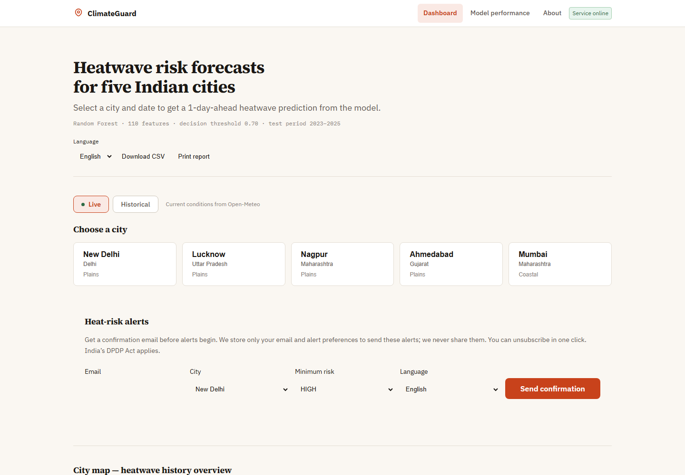
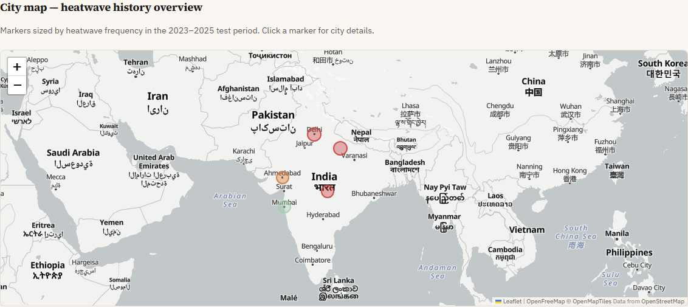
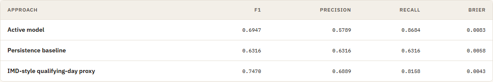
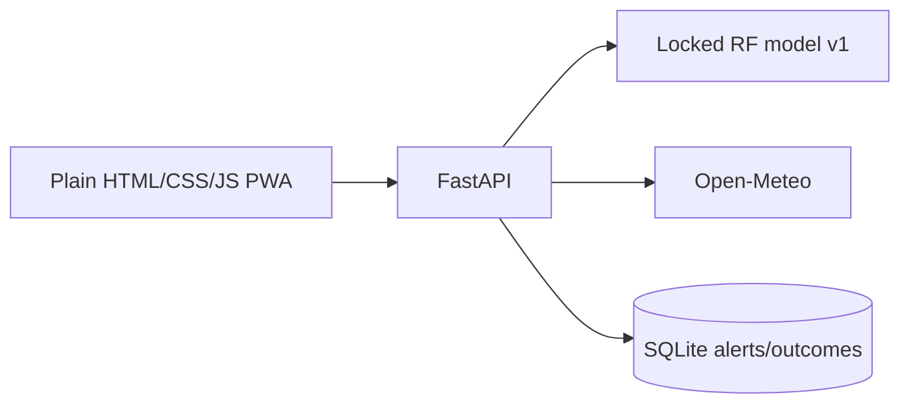

# ClimateGuard ΓÇö Indian Heatwave Prediction

[](https://github.com/adrian-25/Climate-Guard/actions/workflows/quality.yml)

> **Current product notes (September 2026):** ClimateGuard now includes a 7-day live outlook, calibration/baseline reporting, SQLite-backed opt-in alerts, CSV/print/share tools, a PWA shell, Docker, and a Render blueprint. It remains a research model—not an official IMD warning system.

## Dashboard preview



### Explore the product

| City map | Transparent model comparison |
| --- | --- |
|  |  |
| Compare the five validated cities on an India-focused map. | Review the active model alongside persistence and an IMD-style proxy. |

## How to use the website

1. Open the dashboard at `http://localhost:8001` after starting the server.
2. Stay in **Live** mode for the current 7-day Open-Meteo outlook, then select one of the five validated cities. Each day shows the risk level, probability, maximum temperature, humidity, wind, and practical advice.
3. Switch to **Historical** mode to choose a dataset date and run a next-day prediction. Use **Show feature explanation** for the SHAP-based explanation and select a city below the map for trend charts.
4. Use **Model performance** to review calibration, baselines, limitations, and the accumulating live track record before drawing conclusions from a forecast.
5. Download a city’s historical data as CSV, print a report, or share the current city through the page URL.
6. To receive alerts, choose a city, minimum risk level, and language, then enter an email address. Alerts do not start until the confirmation link is used. Hindi and Marathi are machine-drafted and should be reviewed by a native speaker before production use.

ClimateGuard is a research model, not an official warning system. Follow IMD and local-authority advisories during heat emergencies.

## Product quick start

```bash
pip install -r requirements-dev.txt
# Windows PowerShell: Copy-Item .env.example .env
# macOS/Linux:       cp .env.example .env
uvicorn app:app --host 0.0.0.0 --port 8001
python -m pytest
```

The server now reads `.env` automatically for local runs, while variables
provided by Docker or a hosting platform take precedence. For Docker, copy
`.env.example` to `.env` and run `docker compose up --build`. The runtime SQLite
directory is a named volume. See [deployment instructions](docs/deployment.md),
[MODEL_CARD.md](MODEL_CARD.md), and [CHANGELOG.md](CHANGELOG.md).



### Alerts, privacy & safety

Alerts use double opt-in, store only email/city/threshold/language, offer one-click unsubscribe, and default to dry-run delivery. Hindi and Marathi are machine-drafted and need native-speaker review. Configure all production variables through `.env.example`; never commit secrets. New endpoints include `/health`, `/api/subscribe`, `/api/alerts/preview`, and evaluation/track-record routes; existing response shapes remain intact.

**Explainable & Drift-Aware Heatwave Risk Prediction for Indian Cities**

---

## Overview

ClimateGuard is a machine learning project that predicts **1-day-ahead heatwave risk** for five major Indian cities using ERA5 reanalysis weather data. The model is trained on 35 years of daily climate observations (1990ΓÇô2025) and predicts whether tomorrow will be a heatwave day given today's weather conditions.

This repository covers **Part 1 of a three-part student project**:
- **Part 1 (Adrian):** Dataset acquisition, preprocessing, feature engineering, ML modelling, and prediction interface. ← This repository
- **Part 2 (Kshitij):** Risk scoring, adaptation recommendations, and SHAP explainability. ← Consumes Part 1 output
- **Part 3 (Pradnesh):** Expert module, ETL pipeline, and backend integration. ← Consumes Part 1 output

---

## Cities Covered

| City | State | Region | Latitude | Longitude |
|---|---|---|---|---|
| New Delhi | Delhi | Plains | 28.6139 | 77.2090 |
| Lucknow | Uttar Pradesh | Plains | 26.8467 | 80.9462 |
| Nagpur | Maharashtra | Plains | 21.1458 | 79.0882 |
| Ahmedabad | Gujarat | Plains | 23.0225 | 72.5714 |
| Mumbai | Maharashtra | Coastal | 19.0760 | 72.8777 |

---

## Final Model

| Property | Value |
|---|---|
| Model type | Random Forest Classifier |
| Features | 110 (temporal feature set with qualifying_day) |
| Imbalance strategy | Random undersampling (1:10 ratio, train+val only) |
| Decision threshold | 0.70 (fixed from Phase 11 validation) |
| Training period | 1990-01-11 to 2022-12-31 |
| Test period | 2023-01-01 to 2025-08-30 |
| Test F1 | 0.6947 |
| Test Precision | 0.5789 |
| Test Recall | 0.8684 |
| Test PR-AUC | 0.8339 |

The model prioritises **recall** (catch as many real heatwave days as possible) at the cost of precision ΓÇö appropriate for an early-warning system where missed events carry higher public-health risk than false alarms.

---

## Quick Start

### 1. Install dependencies

```bash
pip install fastapi uvicorn scikit-learn joblib pandas numpy xgboost
```

See `docs/setup.md` for the full reproducibility guide.
### Run the dashboard

```bash
uvicorn app:app --host 0.0.0.0 --port 8001
```

Open `http://localhost:8001`. Live forecasts use [Open-Meteo](https://open-meteo.com/); retain its attribution.

### Optional map configuration

The dashboard uses keyless OpenFreeMap Positron vector tiles by default, with Esri World Light Gray Canvas as a WebGL fallback. `MAPPLS_KEY` is optional: Mappls currently documents a separate Web SDK rather than a Leaflet raster endpoint, so this version preserves Leaflet and falls through to OpenFreeMap. For a future Mappls SDK migration, create a key in [Mappls Console](https://auth.mappls.com/console), restrict it to your production domain, and set `MAPPLS_KEY` only in the server environment. Never commit `.env`; use `.env.example` as the reference.

### 2. Use the prediction interface

```python
from src.prediction import ClimateGuardPredictor

# Load once per session
predictor = ClimateGuardPredictor()

# Single prediction ΓÇö pass a dict with all 110 features
result = predictor.predict(features_dict)
print(result.prediction_probability)   # e.g. 0.8342
print(result.prediction_label)         # 1 = heatwave tomorrow, 0 = normal

# Batch prediction
import pandas as pd
results_df = predictor.predict_batch(features_df)

# Raw probability without threshold
prob = predictor.predict_probability(features_dict)
```

### 3. Run the working example

```bash
python examples/predict_example.py
```

### 4. Run tests

```bash
python tests/test_prediction_interface.py
# All 18 tests should pass
```

---

## Project Structure

```
climate guard/
├── README.md                        ← This file
├── PROJECT_MEMORY.md                ← Complete project state record
Γöé
Γö£ΓöÇΓöÇ data/
│   ├── raw/                         ← ERA5 raw data (READ-ONLY)
│   ├── processed/                   ← Cleaned and labelled data (READ-ONLY)
│   ├── features/                    ← Engineered feature datasets (READ-ONLY)
│   └── splits/                      ← Train/val/test splits (READ-ONLY)
│       ├── baseline/                ← 29-feature splits
│       └── temporal/                ← 110-feature splits
Γöé
Γö£ΓöÇΓöÇ models/
│   └── final/                       ← Phase 14 final model artifacts
Γöé       Γö£ΓöÇΓöÇ climateguard_final_model.joblib
Γöé       Γö£ΓöÇΓöÇ feature_list.json
Γöé       ΓööΓöÇΓöÇ metadata.json
Γöé
Γö£ΓöÇΓöÇ src/
│   └── prediction/                  ← Phase 15 prediction interface
Γöé       Γö£ΓöÇΓöÇ __init__.py
Γöé       ΓööΓöÇΓöÇ predictor.py
Γöé
Γö£ΓöÇΓöÇ tests/
│   └── test_prediction_interface.py ← 18 tests (all pass)
Γöé
Γö£ΓöÇΓöÇ examples/
│   └── predict_example.py           ← Working example with real data
Γöé
├── docs/                            ← All project documentation
Γöé   Γö£ΓöÇΓöÇ setup.md
Γöé   Γö£ΓöÇΓöÇ project_structure.md
Γöé   Γö£ΓöÇΓöÇ limitations.md
Γöé   Γö£ΓöÇΓöÇ testing.md
Γöé   Γö£ΓöÇΓöÇ data_dictionary.md
Γöé   Γö£ΓöÇΓöÇ eda_findings.md
Γöé   Γö£ΓöÇΓöÇ preprocessing_decisions.md
Γöé   Γö£ΓöÇΓöÇ heatwave_labeling_methodology.md
Γöé   Γö£ΓöÇΓöÇ final_ml_dataset.md
Γöé   Γö£ΓöÇΓöÇ train_validation_test_split.md
Γöé   Γö£ΓöÇΓöÇ baseline_models.md
Γöé   Γö£ΓöÇΓöÇ class_imbalance.md
Γöé   Γö£ΓöÇΓöÇ model_evaluation.md
Γöé   Γö£ΓöÇΓöÇ temporal_feature_experiment.md
Γöé   Γö£ΓöÇΓöÇ final_model_selection.md
Γöé   Γö£ΓöÇΓöÇ final_model_contract.md
Γöé   Γö£ΓöÇΓöÇ prediction_interface.md
Γöé   Γö£ΓöÇΓöÇ part2_integration_contract.md
Γöé   ΓööΓöÇΓöÇ part3_integration_contract.md
Γöé
├── results/                         ← All metrics, logs, and plots
├── notebooks/                       ← EDA notebook
└── (pipeline scripts)               ← build_ml_dataset.py, etc.
```

See `docs/project_structure.md` for a full annotated inventory.

---

## Data

**Source:** [Open-Meteo Historical Weather API](https://open-meteo.com/) ΓÇö ERA5 reanalysis model at 0.25┬░ resolution.

| Property | Value |
|---|---|
| Rows | 65,135 daily records |
| Cities | 5 |
| Date range | 1990-01-01 to 2025-08-31 |
| Missing values | 0 |
| Duplicates | 0 |

**Important:** The raw data is ERA5 **reanalysis** output, not official IMD station observations. The heatwave label is **IMD-inspired** (based on published IMD criteria), not certified IMD ground truth.

---

## Heatwave Definition

The project uses an **IMD-Inspired Operational Heatwave Label (ERA5-based)**:

**Plains cities** (Delhi, Lucknow, Nagpur, Ahmedabad):
- Heatwave event = ≥ 2 consecutive qualifying days
- Qualifying day = Tmax ≥ 40°C AND departure ≥ 4.5°C, OR Tmax ≥ 45°C (absolute override)

**Coastal city** (Mumbai):
- Qualifying day = Tmax ≥ 37°C AND departure ≥ 4.5°C
- Mumbai has **zero** heatwave events in 35 years under this definition

Departure = daily Tmax minus the city-specific 31-day centred smoothed climatological normal, computed from the 1990ΓÇô2020 baseline.

See `docs/heatwave_labeling_methodology.md` for the full methodology.

---

## Feature Engineering

The model uses 110 features across 7 groups:

| Group | Count | Description |
|---|---|---|
| Current weather | 18 | ERA5 weather variables at date T |
| Lag features | 33 | T-1, T-2, T-3, T-7 values for key variables |
| Rolling features | 42 | 3-day and 7-day rolling stats (excludes T) |
| Trend features | 5 | Tmax delta and slope over 1/3/7 days |
| Anomaly features | 1 | 30-day trailing z-score of Tmax departure |
| Calendar features | 7 | Month, day-of-year, season, cyclic encodings |
| City features | 4 | City encoding, coastal flag, lat/lon |

All lag and rolling features use `shift(1)` to exclude day T from rolling windows ΓÇö no data leakage.

---

## Model Development Pipeline

| Phase | Description | Key Output |
|---|---|---|
| 1ΓÇô3 | Data research, problem definition, acquisition | `data/raw/all_cities_era5_raw.csv` |
| 4 | Exploratory data analysis | `docs/eda_findings.md`, 30 EDA plots |
| 5 | Data cleaning | `data/processed/weather_cleaned.csv` |
| 6 | Heatwave label generation | `data/processed/weather_labelled.csv` |
| 7 | Feature engineering | `data/features/climateguard_features.csv` |
| 8 | Final ML dataset | `data/features/ml_baseline.csv`, `ml_temporal.csv` |
| 9 | Train/val/test split | `data/splits/baseline/`, `data/splits/temporal/` |
| 10 | Baseline ML models | 6 models (LR, RF, XGBoost × 2 feature sets) |
| 11 | Class imbalance handling | 30 strategy experiments, threshold analysis |
| 12 | Held-out test evaluation | 4 candidates evaluated on 2023ΓÇô2025 data |
| 13 | Temporal feature experiment | Baseline vs 110-feature comparison + ablation |
| 14 | Final model selection | `models/final/climateguard_final_model.joblib` |
| 15 | Prediction interface | `src/prediction/predictor.py`, 18/18 tests pass |
| 16 | Documentation | This README + full `docs/` set |

---

## Key Results

| Metric | Value | Notes |
|---|---|---|
| F1 score | 0.6947 | Test set 2023ΓÇô2025 |
| Precision | 0.5789 | ~42% false alarm rate |
| Recall | 0.8684 | Misses 16% of real heatwave days |
| PR-AUC | 0.8339 | Area under precision-recall curve |
| ROC-AUC | 0.9979 | Inflated by extreme class imbalance |
| TP | 33 / 38 | Correctly caught 33 of 38 heatwave days in test |
| FP | 24 | False alarms in 2.5-year test period |

**Per-city test results:**

| City | F1 | Precision | Recall |
|---|---|---|---|
| Delhi | 0.7805 | 0.6957 | 0.8889 |
| Lucknow | 0.6829 | 0.5600 | 0.8750 |
| Nagpur | 0.5000 | 0.3750 | 0.7500 |
| Ahmedabad | N/A | ΓÇö | ΓÇö (0 test positives) |
| Mumbai | N/A | ΓÇö | ΓÇö (0 positives ever) |

---

## Integration Contracts

- **Part 2 (Kshitij):** See `docs/part2_integration_contract.md` ΓÇö SHAP access, probability interface, limitations to document
- **Part 3 (Pradnesh):** See `docs/part3_integration_contract.md` ΓÇö ETL requirements, feature construction, error handling

---

## Limitations

1. ERA5 reanalysis data ΓÇö not official IMD station observations
2. IMD-inspired label ΓÇö not certified IMD ground truth
3. Mumbai: zero heatwave positives in 35 years under this definition; predictions are unreliable
4. Ahmedabad: zero test-set positives (all 32 events fall in 1990ΓÇô2019 training window)
5. `qualifying_day` feature is correlated with the target by construction (same IMD threshold family)
6. Model precision 0.58 ΓÇö ~42% false alarm rate
7. No drift detection; retraining recommended for deployment beyond 2025
8. Feature engineering requires 30+ days of weather history per city

See `docs/limitations.md` for the full discussion.

---

## Tests

```bash
# Run from project root
python tests/test_prediction_interface.py

# Or with pytest
python -m pytest tests/test_prediction_interface.py -v
```

For the full regression suite, run:

```bash
python -m pytest
```

The current suite contains 309 passing tests covering model loading, feature
validation, probability bounds, threshold application, batch prediction, error
handling, explainability, live-data seams, and the DL comparison module.

---

## Documentation Index

| Document | Description |
|---|---|
| `docs/setup.md` | Installation, dependencies, reproducibility guide |
| `docs/project_structure.md` | Annotated file inventory |
| `docs/limitations.md` | Known limitations and research caveats |
| `docs/testing.md` | Test suite description and instructions |
| `docs/data_dictionary.md` | All raw variable definitions and units |
| `docs/eda_findings.md` | Exploratory data analysis findings |
| `docs/preprocessing_decisions.md` | Phase 5 data cleaning decisions |
| `docs/heatwave_labeling_methodology.md` | IMD-inspired label definition |
| `docs/final_ml_dataset.md` | Phase 8 ML dataset documentation |
| `docs/train_validation_test_split.md` | Split boundaries and leakage audit |
| `docs/baseline_models.md` | Phase 10 baseline model results |
| `docs/class_imbalance.md` | Phase 11 imbalance handling strategies |
| `docs/model_evaluation.md` | Phase 12 held-out test evaluation |
| `docs/temporal_feature_experiment.md` | Phase 13 feature ablation study |
| `docs/final_model_selection.md` | Phase 14 model selection rationale |
| `docs/final_model_contract.md` | Input/output specification for the final model |
| `docs/prediction_interface.md` | Phase 15 interface documentation |
| `docs/part2_integration_contract.md` | Integration contract for Part 2 |
| `docs/part3_integration_contract.md` | Integration contract for Part 3 |
| `dl/README_DL.md` | DL training, evaluation, and reproducibility guide |
| `dl/MODEL_CARD_DL.md` | DL model card, limitations, and comparison results |

---

## Deep learning comparison module

ClimateGuard includes a research-only DL comparison module (`dl/`) that trains
GRU and LSTM sequence models on the same India data and evaluates them against
the production RF on the held-out test set.

**Key findings (India test set 2023–2025, 38 positives / 4,865 rows):**

| Model                 | F1     | PR-AUC | Brier  | ECE    |
|-----------------------|--------|--------|--------|--------|
| RF production         | 0.6947 | 0.8339 | 0.0083 | 0.0208 |
| GRU raw-seq ens       | 0.7586 | 0.8414 | 0.0090 | 0.0136 |
| LSTM raw-seq ens      | 0.7234 | 0.8664 | 0.0082 | 0.0124 |
| GRU feat110 ens       | 0.7273 | 0.8579 | 0.0066 | 0.0105 |
| GRU raw-seq focal ens | 0.7529 | 0.8264 | 0.0132 | 0.0368 |

All bootstrap 95% CIs for the F1 difference include zero — results are
competitive with no statistically significant difference vs either RF baseline.
One exception: LSTM vs RF-fair ΔPR-AUC CI = [0.002, 0.274] excludes zero, but
with only 38 test positives this should be interpreted with caution.
The fixed-gamma focal-loss ablation did not improve on the weighted-BCE GRU and
has higher calibration error, so it remains a documented research result rather
than a selected model.
The Brier score and ten-bin expected calibration error (ECE) are test-set
diagnostics, not a claim that the DL probabilities are operationally calibrated.
Each DL ensemble also records cross-seed probability spread as an uncertainty
signal in the machine-readable comparison artifact.
Feature attribution (Integrated Gradients) shows Spearman ρ = 0.687 between DL
and RF importance rankings on 21 common features.

The DL module does not affect the production RF, `model_registry.json`,
`predictor.py`, or any existing route. See [`dl/README_DL.md`](dl/README_DL.md)
for full usage, commands, and limitations. The model card for the DL models is at
[`dl/MODEL_CARD_DL.md`](dl/MODEL_CARD_DL.md).

---

## Important Notes

- **Do NOT retrain** the model. `models/final/climateguard_final_model.joblib` is a locked artifact.
- **Do NOT modify** any file in `data/` ΓÇö all datasets are validated, read-only artifacts.
- **Do NOT change** the threshold (0.70). It was fixed on the validation split before test evaluation.
- **Do NOT implement** Part 2 or Part 3 functionality in this repository.`r`n- **Academic-use disclaimer:** ClimateGuard is a research model, not an official heatwave warning system. Follow India Meteorological Department and local-authority alerts during heat emergencies.

---

## Author

**Adrian** ΓÇö Part 1: Dataset & ML  
ClimateGuard Indian Heatwave Prediction Project  
Date: September 2026
